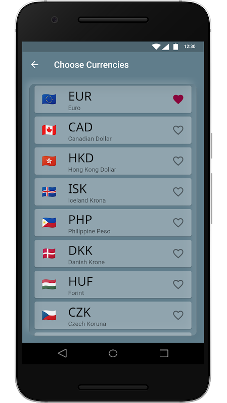

# Dough

An experimental Flutter currency convertor app for Android and iOS.

<!----> 

I built this design study to explore neumorphism and improve my Flutter development skills.
The core code and architechture are based on this very good provider state management [tutorial](https://www.raywenderlich.com/6373413-state-management-with-provider) by Jonathan at [raywenderlich.com](https://www.raywenderlich.com). I added the circular slider and a little bit of neumorphism.

 

Thank you to [Idean](https://www.idean.com/) for the Flutter-Neumorphic package, available [here](https://pub.dev/packages/flutter_neumorphic).

Exchange rate api provided by [https://exchangeratesapi.io/](https://exchangeratesapi.io/) - much appreciated, thank you!

Hat-tip also to [David Anaya](https://github.com/davidanaya/flutter-circular-slider) for the neat Flutter Circular Slider [package](https://pub.dev/packages/flutter_circular_slider).

### TODO
* Move some widgets out of calculate_screen.dart. There is way too much going in there, [pyramids of doom](https://en.wikipedia.org/wiki/Pyramid_of_doom_(programming)) etc.
* Fix my janky code.

### License

[MIT](https://github.com/jurgenizer/dough/blob/master/LICENSE)
